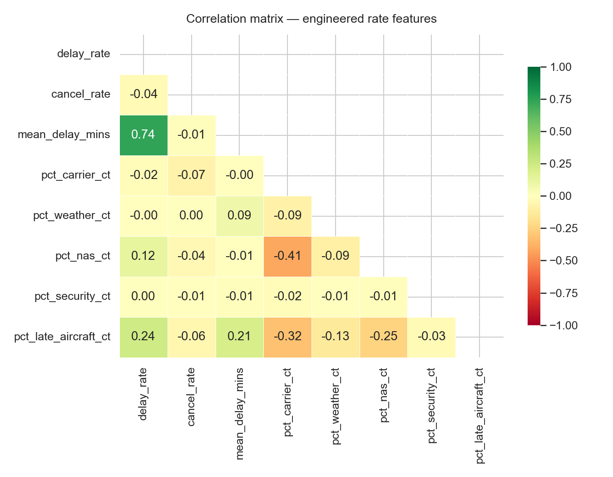
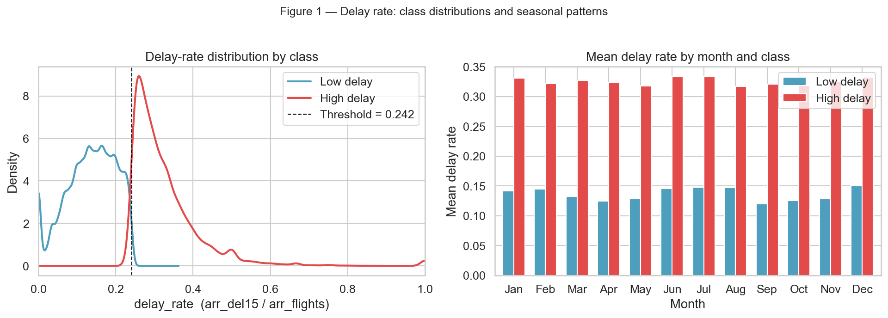
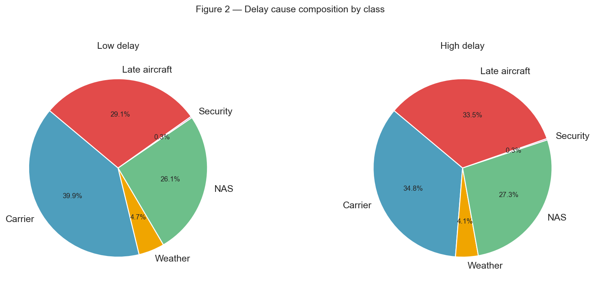
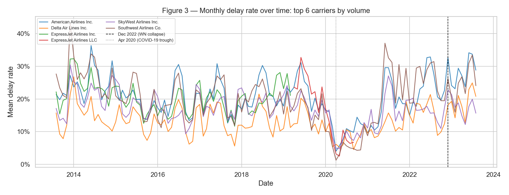

# EDA Report — Airline Delay Prediction & Anomaly Detection
---

## 1. Research Question and Dataset Overview

**Research Question:**
Can historical carrier-level delay statistics predict the likelihood of a high-delay month at a given airport, and can unsupervised anomaly detection identify carrier-airport combinations behaving outside their normal operational patterns?

**Dataset Summary:**
The dataset provides pre-aggregated U.S. flight arrival and delay statistics at the carrier × airport × month level, covering 2013 through 2023 — roughly 10 years of domestic aviation operations. Each row represents one unique carrier-airport-month combination and includes counts for arriving flights, delays of 15+ minutes, cancellations, diversions, and a cause-breakdown across five categories: carrier, weather, NAS (National Airspace System), security, and late aircraft. After filtering rows where `arr_flights == 0`, the dataset contains **171,426 rows and 38 columns**, spanning **21 carriers** and **391 airports**.

**Data Source:**
> Eedala, S. (n.d.). *Airline Delay Cause* [Dataset]. Kaggle.  
> https://www.kaggle.com/datasets/sriharshaeedala/airline-delay

The Kaggle dataset is compiled from the U.S. Bureau of Transportation Statistics (BTS) On-Time Performance database. The BTS primary source is available at https://transtats.bts.gov.

**Legal & Ethical Appropriateness:**
The dataset originates from U.S. federal government data (BTS), which is in the public domain under 17 U.S.C. § 105 — no copyright restrictions apply and no license is required for academic use. The dataset contains no personally identifiable information (PII); all records are aggregated at the carrier × airport × month level with no passenger or employee data present. No ethical concerns are present. Anomaly findings in this project are framed analytically (operational pattern detection) rather than as fault attribution, to avoid misrepresenting correlational results as carrier performance judgments.

---

## 2. Data Description and Variables

**Dataset dimensions (after filter):** 171,426 rows × 38 columns  
**Time range:** 2013–2023 | **Carriers:** 21 | **Airports:** 391

### Key Raw Variables

| Variable | Type | Description |
|---|---|---|
| `year` | int | Year of observation |
| `month` | int | Month of observation (1–12) |
| `carrier` | categorical | IATA carrier code (e.g., WN, AA, DL) |
| `carrier_name` | categorical | Full carrier name |
| `airport` | categorical | IATA airport code |
| `airport_name` | categorical | Full airport name |
| `arr_flights` | numeric | Total arriving flights that month |
| `arr_del15` | numeric | Flights arriving 15+ minutes late |
| `arr_cancelled` | numeric | Cancelled flights |
| `arr_diverted` | numeric | Diverted flights |
| `arr_delay` | numeric | Total arrival delay minutes |
| `carrier_ct` | numeric | Count of delays attributable to carrier |
| `weather_ct` | numeric | Count of delays attributable to weather |
| `nas_ct` | numeric | Count of delays attributable to NAS |
| `security_ct` | numeric | Count of delays attributable to security |
| `late_aircraft_ct` | numeric | Count of delays attributable to late aircraft |

**Target Variables:**
- `high_delay` (binary, derived): 1 if `delay_rate ≥ 0.2415` (75th percentile) — primary supervised classification target, evaluated with AUROC
- `delay_rate` (continuous, derived): `arr_del15 / arr_flights` — secondary regression target and primary anomaly detection input

### Engineered Features

| Feature | Formula | Purpose |
|---|---|---|
| `delay_rate` | `arr_del15 / arr_flights` | Core target & anomaly input |
| `cancel_rate` | `arr_cancelled / arr_flights` | Operational stress signal |
| `divert_rate` | `arr_diverted / arr_flights` | Operational stress signal |
| `mean_delay_mins` | `arr_delay / arr_flights` | Severity of delay per flight |
| `pct_carrier_ct` | `carrier_ct / Σ cause_ct` | Carrier's share of delay causes |
| `pct_weather_ct` | `weather_ct / Σ cause_ct` | Weather's share of delay causes |
| `pct_nas_ct` | `nas_ct / Σ cause_ct` | NAS share of delay causes |
| `pct_security_ct` | `security_ct / Σ cause_ct` | Security share of delay causes |
| `pct_late_aircraft_ct` | `late_aircraft_ct / Σ cause_ct` | Cascade delay share |
| `month_sin`, `month_cos` | `sin/cos(2π × month / 12)` | Cyclical month encoding (preserves Jan ≈ Dec) |
| `is_summer` | months 6, 7, 8 | Peak summer travel flag |
| `is_winter` | months 12, 1, 2 | Winter weather season flag |
| `is_holiday_month` | months 11, 12 | Holiday travel demand flag |
| `carrier_code`, `airport_code` | LabelEncoder | Numeric IDs for tree models |

### Preprocessing Steps

1. **Zero-flight filter:** 1,041 rows where `arr_flights == 0` removed as a division guard. These represent carrier-airport-months with no operations and carry no delay signal.
2. **Missing values:** Cause-count columns (`carrier_ct`, etc.) may be NaN when no delays occurred in a given month; filled with `0` before modeling. No missing values were found in the core count columns after the zero-flight filter.
3. **No duplicate rows:** The natural key `(year, month, carrier, airport)` is unique by dataset construction.
4. **No column renames** required.
5. **Train/test split:** Hard temporal cutoff — all years before 2023 used for training, 2023 held out as the test set. This avoids leakage from rolling operational patterns that a random split would introduce.

---

## 3. Summary Statistics

### Numeric Variables

| Variable | N | Mean | Std | Min | Median | Max |
|---|---|---|---|---|---|---|
| `arr_flights` | 171,426 | 362.53 | 992.89 | 1.0 | 100.0 | 21,977 |
| `delay_rate` | 171,426 | 0.1834 | 0.1103 | 0.0 | 0.1707 | 1.0 |
| `cancel_rate` | 171,426 | 0.0248 | 0.0680 | 0.0 | 0.0049 | 1.0 |
| `divert_rate` | 171,426 | 0.0028 | 0.0124 | 0.0 | 0.0000 | 1.0 |
| `mean_delay_mins` | 171,426 | 11.46 | 10.05 | 0.0 | 9.56 | 712.0 |
| `pct_carrier_ct` | 171,426 | 0.3706 | 0.2185 | 0.0 | 0.3488 | 1.0 |
| `pct_weather_ct` | 171,426 | 0.0435 | 0.0841 | 0.0 | 0.0104 | 1.0 |
| `pct_nas_ct` | 171,426 | 0.2534 | 0.1975 | 0.0 | 0.2317 | 1.0 |
| `pct_security_ct` | 171,426 | 0.0025 | 0.0186 | 0.0 | 0.0000 | 1.0 |
| `pct_late_aircraft_ct` | 171,426 | 0.2904 | 0.1916 | 0.0 | 0.2943 | 1.0 |

### Categorical Variables

| Variable | Unique values | Notes |
|---|---|---|
| `carrier` | 21 | Southwest (WN) highest volume among majors |
| `airport` | 391 | Ranges from major hubs (ATL, ORD, LAX) to small regionals |
| `year` | 11 | 2013–2023 |
| `month` | 12 | All months represented |

### Class Balance

| Class | Count | % |
|---|---|---|
| `high_delay = 0` | ~128,570 | 75.0% |
| `high_delay = 1` | ~42,857 | 25.0% |

High-delay threshold = **0.2415** (75th percentile of `delay_rate`). The 3:1 class imbalance is handled in XGBoost via `scale_pos_weight ≈ 3.0`.

### Correlation Matrix

**Key findings from the correlation matrix:**

- **`mean_delay_mins` ↔ `delay_rate` = 0.74** — the strongest relationship in the matrix. This makes intuitive sense: months where a high fraction of flights are delayed also accumulate more total delay minutes per flight. Both features measure "how bad" delays are, just on different scales. `mean_delay_mins` is included in the anomaly detector but excluded from supervised features to avoid near-redundancy with the target.
- **`pct_late_aircraft_ct` ↔ `delay_rate` = 0.24** — the strongest positive correlation among the cause fractions. Cascade delays (one late inbound aircraft propagating across subsequent legs) are a meaningful systemic driver, and this feature is expected to rank highly in the SHAP plot.
- **`pct_late_aircraft_ct` ↔ `mean_delay_mins` = 0.21** — late-aircraft months not only have more delayed flights but longer delays per flight, consistent with the cascade mechanism.
- **`pct_carrier_ct` ↔ `pct_nas_ct` = −0.41** — the strongest negative correlation in the matrix. By construction the cause fractions sum to 1, so months where NAS inefficiency dominates mechanically suppress the carrier share, and vice versa. This multicollinearity is expected and does not pose a problem for XGBoost (tree models are robust to it), but it is worth noting for any linear baseline.
- **`cancel_rate` ↔ `delay_rate` = −0.04** — near zero and slightly negative, which is the most counterintuitive finding. It suggests that cancelling a flight tends to substitute for recording a delay rather than co-occurring with one — operationally, a carrier that cancels aggressively may actually reduce its measured `arr_del15` count. This is relevant to the anomaly detector: extreme cancellation spikes (e.g., Southwest December 2022) are not well captured by `delay_rate` alone.

---

## 4. Visual Exploration

### Figure 1 — Delay Rate Distribution by Class and Season

**What it shows:** The left panel is a KDE of `delay_rate` for high-delay (red) vs. low-delay (blue) months, with the 0.2415 threshold marked. The right panel shows mean `delay_rate` by calendar month for each class.

**Relevance:** The KDE confirms the two classes separate cleanly around the threshold — the 75th-percentile target definition is not arbitrary and the distributions are genuinely distinct. The monthly bar chart reveals that the high-delay class maintains a consistently elevated mean rate (~0.32–0.33) across all 12 months with relatively little seasonal variation within the class, while the low-delay class shows a modest dip in the spring months (March–May, ~0.12–0.13). The absence of strong within-class seasonality suggests the classifier will need carrier and cause-fraction features — not just month — to discriminate well, which directly motivates the full feature set used in the XGBoost model.

---

### Figure 2 — Delay Cause Composition: High-Delay vs. Low-Delay Months

**What it shows:** Side-by-side pie charts of the mean cause-fraction breakdown for low-delay (left) and high-delay (right) months.

**Relevance:** The shift from low to high delay is driven primarily by **late aircraft growing from 29.1% to 33.5%** and **carrier share growing from 39.9% to 34.8%** — wait, reading the charts carefully: carrier actually *decreases* slightly (39.9% → 34.8%) while late aircraft *increases* (29.1% → 33.5%) and NAS increases slightly (26.1% → 27.3%). This is a meaningful finding: high-delay months are not simply months where carriers perform worse internally — they are months where cascade effects (late inbound aircraft) and systemic NAS congestion amplify across the network. Weather remains a minor share in both classes (~4–5%), which is consistent with the near-zero `pct_weather_ct` ↔ `delay_rate` correlation seen in the matrix. This supports `pct_late_aircraft_ct` as the primary cause-fraction feature for the classifier.

---

### Figure 3 — Monthly Delay Rate Over Time: Top 6 Carriers by Volume

**What it shows:** A time-series of mean monthly `delay_rate` for the six highest-volume carriers (American, Delta, ExpressJet Inc., ExpressJet LLC, SkyWest, Southwest) from 2013 to 2023, with vertical markers at the April 2020 COVID-19 trough (dotted) and December 2022 Southwest collapse (dashed).

**Relevance:** Two structural events stand out. The **COVID-19 trough (April 2020)** shows a near-universal collapse in delay rates to near 0% across all carriers — dramatically reduced flight volume eliminated the cascade congestion that normally propagates delays systemwide. This is precisely the kind of anomaly the Isolation Forest should flag: the operational profile (tiny `arr_flights`, near-zero cause fractions) is structurally unlike any normal month. The **December 2022 Southwest spike** is visible as a sharp upturn for Southwest (Co.) at the rightmost dashed line, confirming the event is present in the data and is the primary real-world validation target for the anomaly detector. Persistent cross-carrier divergence throughout the full 2013–2023 period — Delta consistently running 5–10 percentage points below the field — also confirms that `carrier_code` carries meaningful predictive signal independent of season or airport.

---

## 5. Challenges and Reflection

**Dataset selection tradeoffs:** The key tradeoff in choosing the Kaggle pre-aggregated dataset over the raw BTS flight-level data was scope vs. granularity. The monthly aggregation makes each row directly usable as a training example without any groupby operations, keeping the pipeline fast and interpretable on a standard laptop. The cost is that intra-month variation is invisible — a carrier could have three stable weeks and one catastrophic week, but the model sees only the monthly average. For this project's scope that is acceptable, but it means short-lived disruptions (e.g., a 3-day ground stop) that do not move the monthly aggregate past the 0.2415 threshold will be missed by the classifier entirely.

**Current challenge — the cancellation-delay disconnect:** The near-zero correlation between `cancel_rate` and `delay_rate` (r = −0.04) revealed that the December 2022 Southwest collapse — primarily a cancellation event rather than a delay event — may be poorly captured by the supervised target as defined. Southwest's December 2022 `delay_rate` may not spike as dramatically as expected because mass cancellations reduce the pool of arriving flights used in the denominator. This is a meaningful concern: the anomaly detector, which uses `cancel_rate` and `mean_delay_mins` directly alongside `delay_rate`, may actually be better positioned to flag that event than the classifier. The cross-tabulation of classifier predictions against anomaly scores in the joint analysis will be the key test of this hypothesis.
