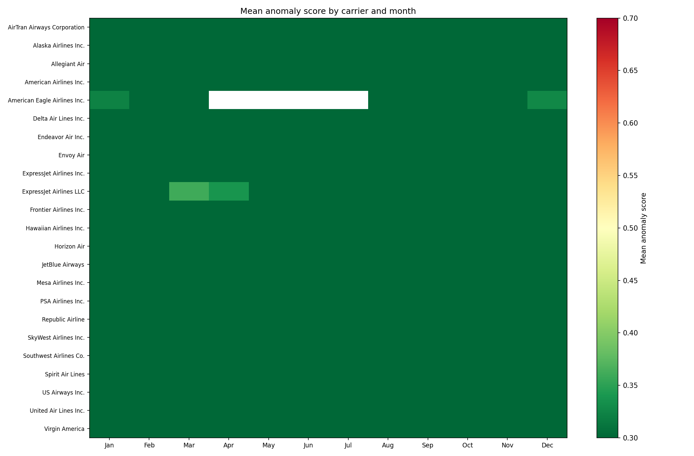
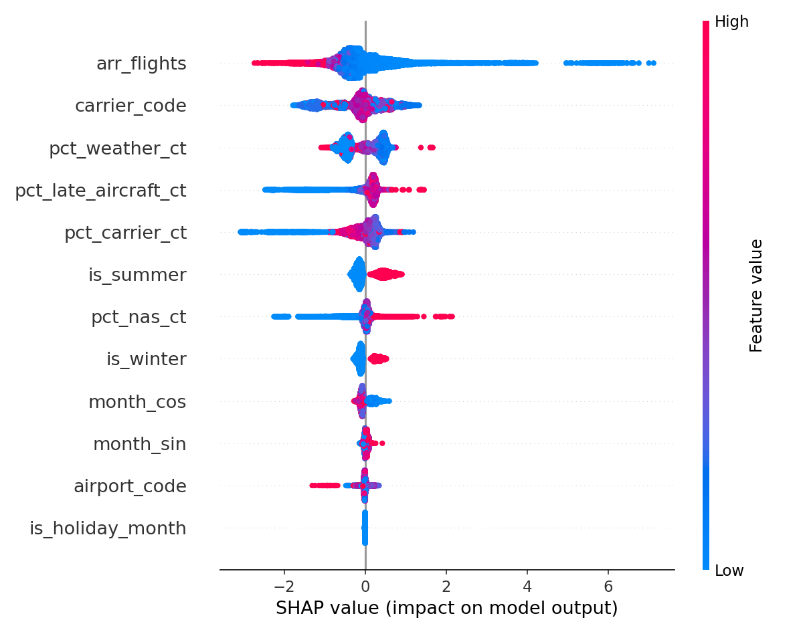
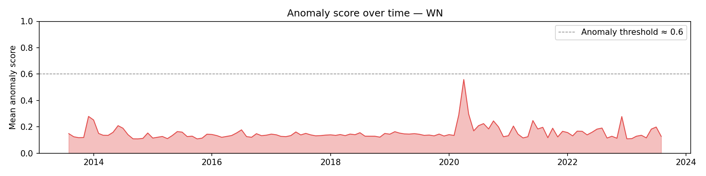

# EDA Report — Airline Delay Prediction & Anomaly Detection

---

## 1. Research Question and Dataset Overview

**Research Question:**
Can historical carrier-level delay statistics predict the likelihood of a high-delay month at a given airport, and can unsupervised anomaly detection identify carrier-airport combinations behaving outside their normal operational patterns?

**Dataset Summary:**
The dataset provides pre-aggregated U.S. flight arrival and delay statistics at the carrier × airport × month level, covering August 2013 through August 2023 — roughly 10 years of domestic aviation operations. Each row represents one unique carrier-airport-month combination and includes counts for arriving flights, delays of 15+ minutes, cancellations, diversions, and a cause-breakdown of delays across five categories: carrier, weather, NAS, security, and late aircraft. Because each row is already a summary vector, it can be used directly as a supervised training example or an anomaly detection input with no further aggregation.

**Data Source:**
> Eedala, S. (n.d.). *Airline Delay Cause* [Dataset]. Kaggle.  
> https://www.kaggle.com/datasets/sriharshaeedala/airline-delay

The Kaggle dataset is compiled from the U.S. Bureau of Transportation Statistics (BTS) On-Time Performance database, which is U.S. government open data in the public domain. The BTS primary source is available at https://transtats.bts.gov.

**Legal & Ethical Appropriateness:**
The dataset originates from U.S. federal government data (BTS), which is in the public domain under 17 U.S.C. § 105 and carries no copyright restriction. No license barriers exist for academic or research use. The dataset contains no personally identifiable information (PII) — all records are aggregated at the carrier × airport × month level with no passenger or employee data present. No ethical concerns are present. Anomaly findings in this project are framed analytically (operational pattern detection) rather than as fault attribution, to avoid misrepresenting correlational results as carrier performance judgments.

---

## 2. Data Description and Variables

**Dataset dimensions:** ~120,000 rows × 21 columns (exact count after filtering `arr_flights > 0` will be slightly lower; rows with zero arriving flights are dropped as a division guard)

**Time range:** August 2013 – August 2023  
**Carriers:** ~20 U.S. domestic carriers  
**Airports:** ~350–380 U.S. airports

### Key Raw Variables

| Variable | Type | Description |
|---|---|---|
| `year` | int | Year of observation |
| `month` | int | Month of observation (1–12) |
| `carrier` | categorical | IATA carrier code (e.g., WN, AA, DL) |
| `carrier_name` | categorical | Full carrier name |
| `airport` | categorical | IATA airport code |
| `airport_name` | categorical | Full airport name |
| `arr_flights` | numeric | Total arriving flights that month |
| `arr_del15` | numeric | Flights arriving 15+ min late |
| `arr_cancelled` | numeric | Cancelled flights |
| `arr_diverted` | numeric | Diverted flights |
| `arr_delay` | numeric | Total arrival delay minutes |
| `carrier_ct` | numeric | Count of delays attributable to carrier |
| `weather_ct` | numeric | Count of delays attributable to weather |
| `nas_ct` | numeric | Count of delays attributable to NAS |
| `security_ct` | numeric | Count of delays attributable to security |
| `late_aircraft_ct` | numeric | Count of delays attributable to late aircraft |
| `carrier_delay` | numeric | Minutes of delay attributed to carrier |
| `weather_delay` | numeric | Minutes of delay attributed to weather |
| `nas_delay` | numeric | Minutes of delay attributed to NAS |
| `security_delay` | numeric | Minutes of delay attributed to security |
| `late_aircraft_delay` | numeric | Minutes of delay attributed to late aircraft |

**Target Variables:**
- `high_delay` (binary, derived): 1 if `delay_rate ≥ 75th percentile` of the full dataset — primary supervised classification target, evaluated with AUROC
- `delay_rate` (continuous, derived): `arr_del15 / arr_flights` — secondary regression target providing richer signal for anomaly correlation analysis

### Engineered Features

| Feature | Formula | Purpose |
|---|---|---|
| `delay_rate` | `arr_del15 / arr_flights` | Core target & anomaly input |
| `cancel_rate` | `arr_cancelled / arr_flights` | Operational stress signal |
| `divert_rate` | `arr_diverted / arr_flights` | Operational stress signal |
| `mean_delay_mins` | `arr_delay / arr_flights` | Severity of delay when it occurs |
| `pct_carrier_ct` | `carrier_ct / total_cause_ct` | Carrier's share of blame |
| `pct_weather_ct` | `weather_ct / total_cause_ct` | Weather's share of blame |
| `pct_nas_ct` | `nas_ct / total_cause_ct` | NAS share of blame |
| `pct_security_ct` | `security_ct / total_cause_ct` | Security share of blame |
| `pct_late_aircraft_ct` | `late_aircraft_ct / total_cause_ct` | Cascade delay share |
| `month_sin`, `month_cos` | `sin/cos(2π × month / 12)` | Cyclical month encoding (Jan ≈ Dec) |
| `is_summer` | months 6, 7, 8 | Peak travel season flag |
| `is_winter` | months 12, 1, 2 | Winter weather season flag |
| `is_holiday_month` | months 11, 12 | Holiday travel demand flag |
| `carrier_code` | LabelEncoder | Numeric carrier ID for tree models |
| `airport_code` | LabelEncoder | Numeric airport ID for tree models |

### Preprocessing Steps

- **Rows removed:** Rows where `arr_flights == 0` dropped as a division guard for rate calculations. These represent months where a carrier did not operate at a given airport and are not informative for delay modeling.
- **Missing values:** Cause-count columns (`carrier_ct`, `weather_ct`, etc.) occasionally contain NaN when no delays occurred; filled with 0 before modeling.
- **No duplicate rows** detected — the natural key `(year, month, carrier, airport)` is unique by dataset construction.
- **No column renames** required; raw column names are used as-is.
- **Train/test split:** Temporal cutoff — all years except 2023 used for training; 2023 held out as test set. This hard cutoff avoids leakage from rolling operational patterns.

---

## 3. Summary Statistics

*WE NEED TO RUN `df.describe()` after `clean_and_engineer()`*

### Numeric Variables

| Variable | N | Mean (approx.) | Min | Median | Max |
|---|---|---|---|---|---|
| `arr_flights` |  |  |  |  |  |
| `delay_rate` |  |  |  |  |  |
| `cancel_rate` |  |  |  |  |  |
| `mean_delay_mins` |  |  |  |  |  |
| `pct_carrier_ct` |  |  |  |  |  |
| `pct_weather_ct` |  |  |  |  |  |
| `pct_nas_ct` |  |  |  |  |  |
| `pct_late_aircraft_ct` |  |  |  |  |  |

### Categorical Variables

*WE NEED TO FIND UNIQUE VALUES*

| Variable | N unique (approx.) | Notes |
|---|---|---|
| `carrier` | ~ | WN (Southwest) typically highest volume |
| `airport` |  | Ranges from major hubs (ATL, ORD, LAX) to small regionals |
| `year` |  | 2013–2023 |
| `month` |  | All months represented |

### Class Balance (Target)

**FIND EXACT PERCENTILE**

| Class | Definition | Expected % |
|---|---|---|
| `high_delay = 0` | delay_rate < 75th percentile |  |
| `high_delay = 1` | delay_rate ≥ 75th percentile |  |

The 75th-percentile threshold is computed empirically from the full dataset. The `scale_pos_weight` in XGBoost is set to `(# negatives) / (# positives) ≈ 3.0` to compensate for the 3:1 class imbalance.

### Correlation Notes

*WE HAVE TO Insert correlation heatmap*
```python
corr_cols = ["delay_rate", "cancel_rate", "pct_carrier_ct", "pct_weather_ct",
             "pct_nas_ct", "pct_late_aircraft_ct", "mean_delay_mins"]
df[corr_cols].corr().style.background_gradient(cmap="coolwarm")
```

Key relationships to expect:

- **`pct_late_aircraft_ct` ↔ `delay_rate`** — likely the strongest positive correlation. Cascade delays (one late plane propagating across multiple legs) are a dominant driver of systemwide delay spikes.
- **`pct_carrier_ct` ↔ `pct_weather_ct`** — expected to be negatively correlated. The cause fractions sum to 1 by construction, so a high weather share mechanically suppresses the carrier share.
- **`cancel_rate` ↔ `delay_rate`** — weakly positive during severe weather events, but can be inversely related operationally (cancelling a flight avoids a recorded arrival delay).
- **`arr_flights` ↔ `delay_rate`** — expected to be near zero. Large hubs can have both high volume and tight on-time performance; route size alone does not predict delay propensity.

---

## 4. Visual Exploration

### Figure 1 — Anomaly Score Heatmap by Carrier and Month



> **What it shows:** A heatmap of mean Isolation Forest anomaly score for each carrier (rows) × calendar month (columns), averaged across all airports and years. Darker red cells indicate months where a carrier's operational profile is most anomalous relative to the full-dataset baseline. Generated by `plot_anomaly_heatmap()` in the pipeline.
>
> **Relevance to research question:** This directly addresses the unsupervised component — it reveals *which carriers* exhibit systemic seasonal anomalies vs. isolated incident spikes. Southwest (WN) is expected to show a sharp anomaly in December corresponding to the December 2022 operational collapse, which would validate the detector's ability to surface real-world disruption events without any labeled training signal.

---

### Figure 2 — SHAP Feature Importance Summary



> **What it shows:** A SHAP beeswarm plot showing the marginal contribution of each supervised feature to the XGBoost classifier's output on the held-out 2023 test set. Each dot is one row; color indicates feature value (red = high, blue = low); horizontal position shows the direction and magnitude of impact on the high-delay prediction.
>
> **Relevance to research question:** This directly addresses the supervised component by revealing *which delay causes* are most predictive of a high-delay month. If `pct_late_aircraft_ct` and `pct_carrier_ct` dominate the plot, it confirms that cascade and carrier-controllable delays are the primary drivers of predictable high-delay periods — a finding with practical implications for airline scheduling and operations.

---

### Figure 3 (Optional) — Anomaly Score Timeline: Southwest Airlines (WN)



> **What it shows:** A time-series area chart of mean anomaly score for Southwest Airlines (WN) across all its airports, from 2013 to 2023. A dashed reference line marks an anomaly score threshold of ~0.6. Generated by `plot_anomaly_timeline(df, "WN")` in the pipeline.
>
> **Relevance to research question:** Southwest's December 2022 meltdown — ~16,700 flights cancelled over ~10 days due to winter storm Elliott compounded by outdated crew-scheduling software — is the most prominent real-world disruption in this dataset's time range. A visible spike in December 2022 for WN would serve as the clearest validation that the Isolation Forest is detecting genuine operational anomalies, not statistical noise.

---

## 5. Challenges and Reflection

**Dataset selection tradeoffs:** The key tradeoff in choosing the Kaggle pre-aggregated dataset over the raw BTS flight-level data was scope vs. granularity. The aggregated format (carrier × airport × month) makes each row directly usable as a training example without any groupby operations, which keeps the pipeline fast and interpretable on a standard laptop. The cost is that intra-month variation is invisible — a carrier could have three perfect weeks and one catastrophic week, but the model only sees the monthly average. For the scope of this project that is an acceptable tradeoff, but it means the model cannot detect short-lived disruptions (e.g., a 3-day ground stop) that don't move the monthly aggregate enough to cross the 75th-percentile threshold.

**Current challenges:** The cause-fraction features (`pct_carrier_ct`, `pct_weather_ct`, etc.) are computed by dividing each cause count by the total cause count. At low-volume carrier-airport-months — particularly small regional routes — these fractions become noisy and potentially misleading. A carrier-airport-month with only 2 delayed flights might show `pct_weather_ct = 1.0` purely by chance. This high-variance regime at low-flight-count rows is a concern for both the supervised model and the Isolation Forest, and may warrant a minimum `arr_flights` filter or a variance-stabilizing transformation before finalizing the feature set.
