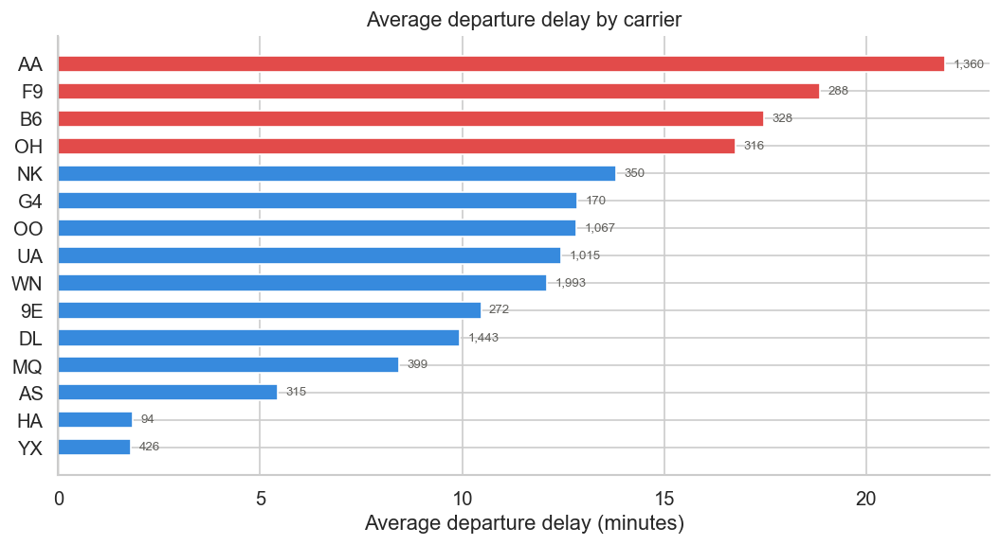
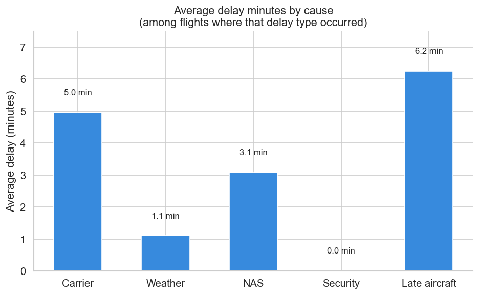

# EDA Report — Airline Delay Prediction & Anomaly Detection
---

## 1. Research Question and Dataset Overview

**Research Question:**
Can we predict how delayed a flight will be and whether it will arrive more than 15 minutes late? Given delayed flights, can we determine any patterns between carriers, airports, etc.?

**Dataset Summary:**
This dataset contains detailed flight performance and delay information for domestic flights in 2024, merged from monthly BTS TranStats files into a single cleaned dataset. It includes over 7 million rows and 35 columns, providing comprehensive information on scheduled and actual flight times, delays, cancellations, diversions, and distances between airports. The dataset is suitable for exploratory data analysis (EDA), machine learning tasks such as delay prediction, time series analysis, and airline/airport performance studies.

**Data Source:**
> Patil, Hrishit *Flight Delay Dataset - 2024* [Dataset]. Kaggle.  
> https://www.kaggle.com/datasets/hrishitpatil/flight-data-2024?select=flight_data_2024_sample.csv

The Kaggle dataset is compiled from the U.S. Bureau of Transportation Statistics (BTS) TranStats database. The BTS primary source is available at https://transtats.bts.gov.

**Legal & Ethical Appropriateness:**
The dataset originates from U.S. federal government data (BTS), which is in the public domain under 17 U.S.C. § 105 — no copyright restrictions apply and no license is required for academic use. The dataset contains no personally identifiable information (PII); all records are aggregated with no passenger or employee data present. No ethical concerns are present. 

---

## 2. Data Description and Variables

**Dataset dimensions (after filter):** 10,000 rows × 35 columns  
**Time range:** January 2024 - December 2024 | **Carriers:** 21 | **Airports:** 391

### Key Raw Variables

| Variable | Type | Description |
|---|---|---|
| `year` | int | Year of flight |
| `month` | int | Month of flight (1–12) |
| `day_of_month` | int | Day of the month |
| `day_of_week` | int | Day of week (1=Monday ... 7 = Sunday) |
| `fl_date` | datetime | Flight date (YYY-MM-DD) |
| `op_unique_carrier` | object | Unique carrier code |
| `op_carrier_fl_num` | float | Flight number for reporting airline |
| `origin` | object | Origin airport code |
| `origin_city_name` | object | Origin city name |
| `origin_state_nm` | object | Origin state name |
| `dest` | object | Destination airport code |
| `dest_city_name` | object | Destination city name |
| `dest_state_name` | object | Destination state name |
| `crs_dep_time` | int | Scheduled departure time (local, hhmm) |
| `dep_time` | float | Actual departure time (local, hhmm) |
| `dep_delay` | float | Departure delay in minutes (negative if early) |
| `taxi_out` | float | Taxi out time in minutes |
| `wheels_off` | float | Wheels-off time (local, hhmm) |
| `wheels_on` | float | Wheels-on time (local, hhmm) |
| `taxi_in` | float | Taxi in time in minutes |
| `crs_arr_time` | int | Scheduled arrival time (local, hhmm) |
| `arr_time` | float | Actual arrival time (local, hhmm) |
| `arr_delay` | float | Arrival delay in minutes (negative if early) |
| `cancelled` |	int | Cancelled flight indicator (0=No, 1=Yes) |
| `cancellation_code` |	object | Reason for cancellation (if cancelled) |
| `diverted` | int | Diverted flight indicator (0=No, 1=Yes) |
| `crs_elapsed_time` | float | Scheduled elapsed time in minutes |
| `actual_elapsed_time` | float | Actual elapsed time in minutes |
| `air_time` | float | Flight time in minutes |
| `distance` | float | Distance between origin and destination (miles) |
| `carrier_delay` | int | Carrier-related delay in minutes |
| `weather_delay` | int | Weather-related delay in minutes |
| `nas_delay` | int | National Air System delay in minutes |
| `security_delay` | int | Security delay in minutes |
| `late_aircraft_delay` | int | Late aircraft delay in minutes |

**Target Variables:**
- `dep_delay > 15` (binary, supervised): 1 if `delay_rate ≥ 15` 

### Preprocessing Steps

1. **Non-cancelled flights:** 122 rows where `canceled == 0` were removed because the rest of their entries are NULL
2. **Missing values:** removed rows where delay columns were NULL
3. **No duplicate rows:** The natural key `op_carrier_fl_num` is unique by dataset construction.
4. **No column renames** required.

---

## 3. Summary Statistics

### Numeric Variables

| Variable | N | Mean | Std | Min | Max |
|---|---|---|---|---|---|---|
| `arr_delay` | 9,836 | 7.55 | 55.80 | -78 | 2,014 |
| `dep_delay` | 9,836 | 12.91 | 53.47 | -22 | 2011 |
| `distance` | 9,836 | 836.09 | 596.39 | 31 | 5095 |
| `taxi_out` | 9,836 | 17.87 | 9.78 | 4 | 154 |
| `crs_elapsed_time` | 9,836 | 147.09 | 72.74 | 23 | 685 |

### Categorical Variables

| Variable | Unique values | Notes |
|---|---|---|
| `carrier` | 21 | Southwest (WN) highest volume among majors |
| `airport` | 391 | Ranges from major hubs (ATL, ORD, LAX) to small regionals |
| `year` | 11 | 2013–2023 |
| `month` | 12 | All months represented |

---

## 4. Visual Exploration

### Figure 1 — Departure Delay Histogram

**What it shows:** The distribution of all flights' departure delay. 

**Relevance:** The histogram shows that the distribution is right skewed. Most of the flights are departing early or right on time, with a few having extreme departure delays. The dashed line shows the 15 minute mark for departure delay.

---

### Figure 2 — Average Departure Delay by Carrier

**What it shows:** The average departure delay by airline carriers. Those that have an average greater than 15 minutes are red.

**Relevance:** American Airlines takes the lead with 1,360 flights with an average above 20 minutes. Frotiner and JetBlue follow behind. Alaska and Hawaiian Airlines are the airlines with the lowest average departure delay.

---

### Figure 3 — Average Delay by Causes

**What it shows:** Describes the average departure delay times for the four delay causes: carrier, weather, NAS, security, and late aircraft arriving.

**Relevance:** Shows that highest departure delay was impacted by late aircraft arriving. Security, not being responsible for departure delay.

---
